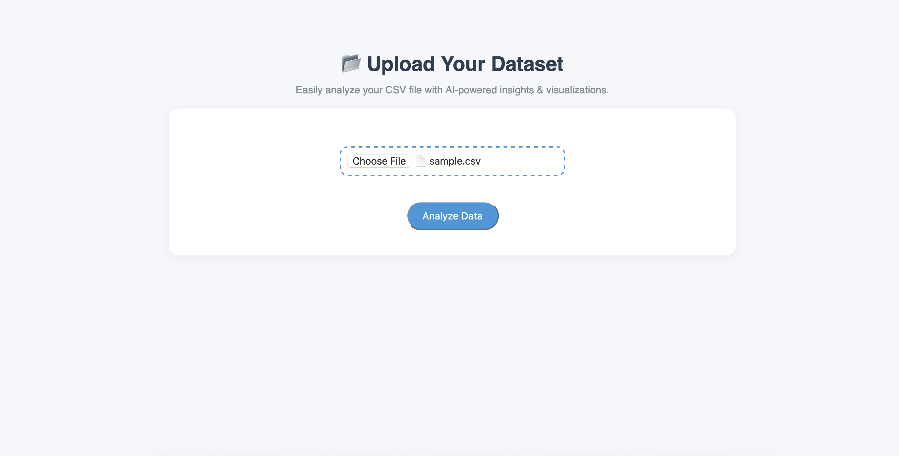

# AI Agent for Data Analysis

A modular, extensible AI-powered data analysis tool built with Flask, OpenAI, and a custom MCP server. Upload CSV files, ask questions, and get automated insights, visualizations, and summaries.

---

## Features
- **CSV Upload:** Easily upload your dataset for analysis.
- **Dashboard UI:** Modern, responsive interface for analysis and results.
- **Visualization Support:** Plots rendered as images, displayed in the dashboard.
- **Markdown Rendering:** LLM insights shown as neat, readable Markdown.

---

## Setup Instructions

### 1. Prepare Your Project Structure
Upload the following folders into your project:
- `templates/` (HTML templates for UI)
- `static/` (CSS and static assets)
- `uploads/` (for storing uploaded CSV files)

### 2. Add Your Python Files
Make sure you have your main Flask app (`app.py`) and MCP server (`mcp_server.py`) in the root or `app/` folder.

### 3. Create a Python Virtual Environment
```sh
python3 -m venv .venv
source .venv/bin/activate
```

### 4. Install Dependencies
```sh
pip install -r requirements.txt
```

### 5. Add Your OpenAI API Key
Create a file named `.env` in the same folder as your Python files:
```
OPENAI_API_KEY=your_openai_api_key_here
```
**Never commit your `.env` file to git!**

### 6. Run the MCP Server
```sh
python mcp_server.py
```

### 7. Run the Flask App
Open a new terminal, activate your environment, and run:
```sh
python app.py
```

### 8. Access the App
Go to [http://localhost:5000](http://localhost:5000) in your browser.

---

## Usage Guide

1. **Upload CSV:** On the home page, upload your dataset.
2. **Analyze:** After upload, you'll see dataset columns and a question box.
3. **Ask Questions:** Type any data analysis question (e.g., "Show missing values", "Plot age vs salary", "Find outliers").
4. **Results Dashboard:** View visualizations, summaries, and Markdown insights.
5. **Reset:** Use the reset button to upload a new dataset.

---

## Project Structure
```
AI-NEW-AGENT/
├── app.py                # Main Flask app
├── mcp_server.py         # Modular MCP server
├── templates/            # HTML templates (dashboard UI)
│   ├── index.html
│   ├── analyze.html
│   └── result.html
├── static/               # CSS and static assets
│   └── style.css
├── uploads/              # Uploaded CSV files
├── .env                  # Your OpenAI API key (not tracked by git)
└── requirements.txt      # Python dependencies
```

---
## 📸 Screenshots

### 1. Upload CSV File  
Easily upload your dataset to start the analysis.  
  

---

### 2. Ask a Question  
Type your query, such as *“give me any visualisation of salary”*.  
  

---

### 3. Visualization Example  
The agent generates a **Histogram of Salary** along with a clear explanation of the distribution.  
  

---

### 4. Missing Values Report  
Quickly check how many **null values** exist across all columns.  
  


---

## Troubleshooting
- **OpenAI API errors:** Check your `.env` and API key.
- **MCP server not running:** Make sure `mcp_server.py` is started before `app.py`.
- **CSV upload issues:** Ensure your file is a valid CSV and not too large.

---

